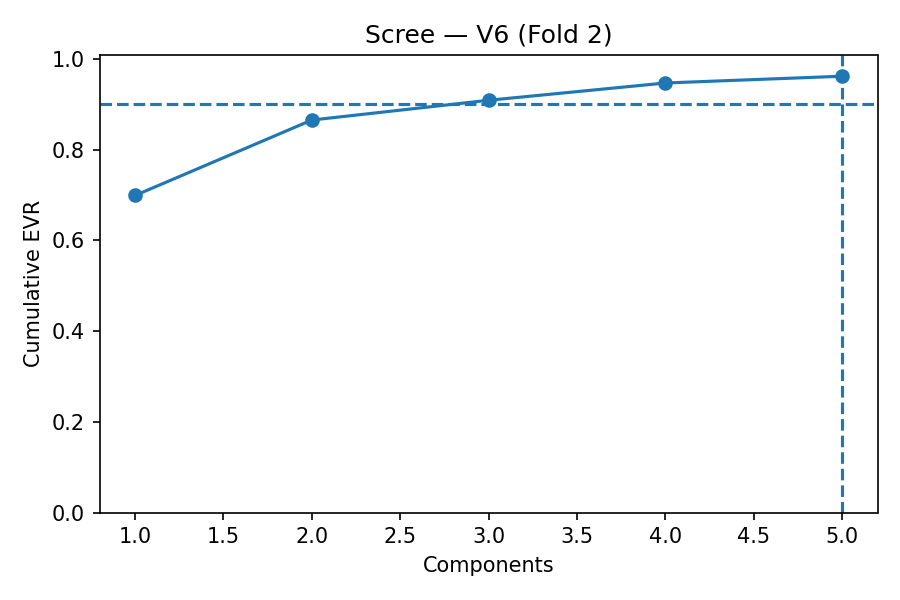
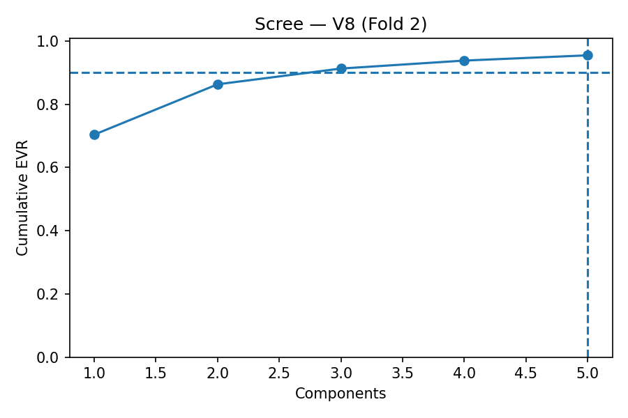
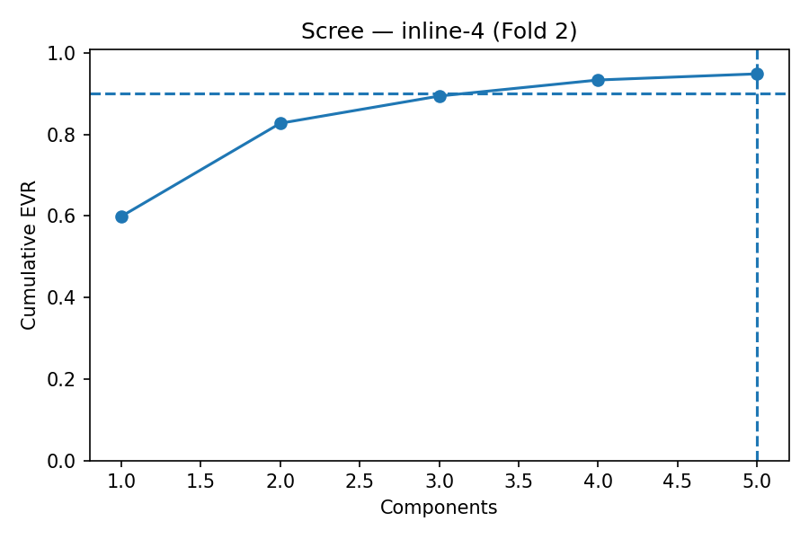
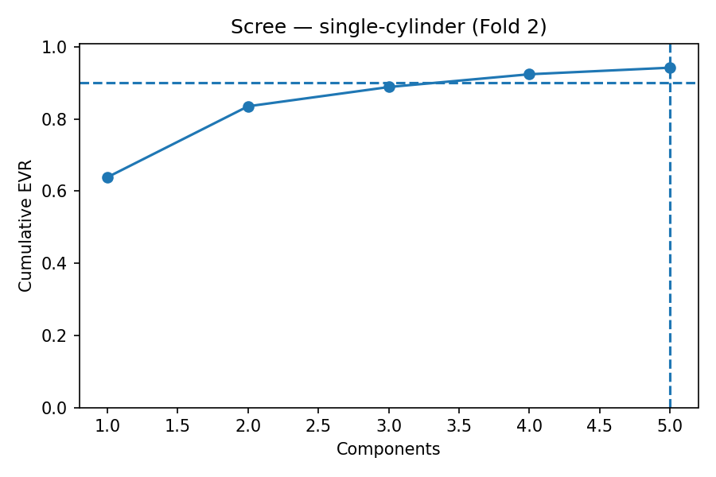
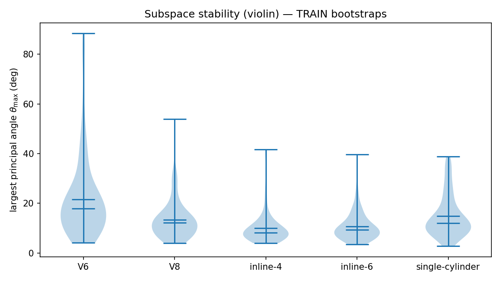
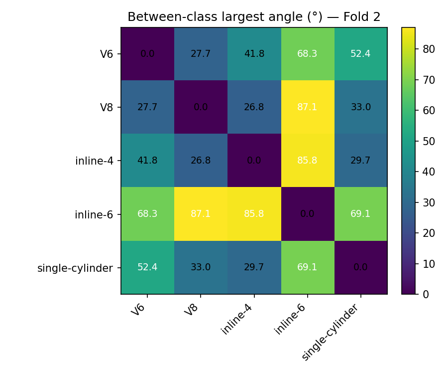
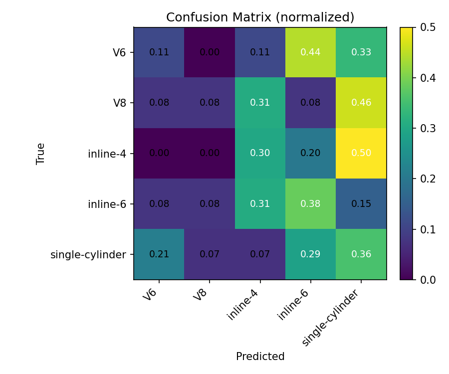
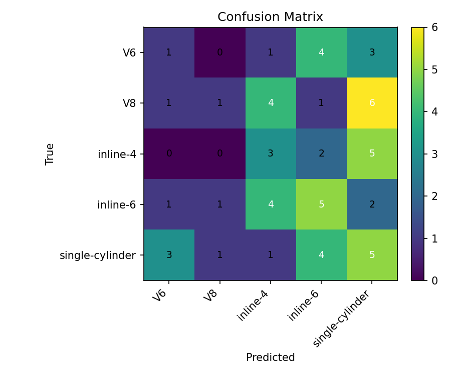

# Low-Dimensional, Stable, and Moderately Discriminative Subspaces for Engine Sound Attributes

## Abstract
We study whether engine sounds with a fixed attribute live in low-dimensional, stable, and moderately discriminative linear subspaces. Using 5-fold cross‑validation on the attribute `engine_configuration` with MFCC features (20 + Δ + ΔΔ → D=60), we fit class‑conditional PCA subspaces (uniform rank r=5) on TRAIN frames, assess stability via bootstrapped principal angles, and evaluate discriminativeness using a calibrated nearest‑subspace classifier (NSC) with trimmed aggregation (q=0.40, K≥10). Results show that r=5 captures roughly 94–96% cumulative explained variance (EVR) across classes, bootstrapped largest principal angles are typically modest (≈12–18° median for most classes; inline‑6 is weaker), and NSC achieves 25.6% ± 2.0% overall accuracy vs. 20% chance. Between-class geometry aligns with confusions: the closest class pairs in angle space drive misclassifications.

---

## Overview
- Goal: Test the hypothesis that engine sounds of a shared attribute lie in low‑dimensional, stable, and moderately discriminative subspaces.
- Attribute(s): `engine_configuration` (classes: V6, V8, inline‑4, inline‑6, single‑cylinder).
- Pipeline (from code):
  - Feature extraction: Per‑clip MFCC with deltas (60‑D) from frames uniformly selected per clip; per‑clip CMVN by centering in the subspace pipeline.
  - Subspaces: Per‑class PCA on TRAIN frames, uniform rank `r=5`.
  - Stability: Bootstrap re‑fitting on TRAIN (B=10 bootstraps, 70% of clips each) and reporting largest principal angles.
  - Classification (NSC): Frame residuals to class subspaces → trimmed aggregation per clip (q=0.40, min K=10) → per‑class z‑score calibration estimated on TRAIN → argmin on calibrated scores.

Code references: `prepare_data.py`, `make_mfcc_frames.py`, `cv_subspace_pipeline.py`, `nsc_calibrated.py`.

---

## Data & Features
- Dataset composition (5 classes). Feature dimension `D=60` (MFCC‑20 + Δ + ΔΔ). Target sample rate 22.05 kHz, mono; frames from voiced audio with `frame_length=2048`, `hop_length=512`; up to ~50 frames/clip targeted in preprocessing.
- Primary feature setup: 60‑D. No 20‑D runs detected; 60‑D is used throughout.

Table D1 – Dataset summary (per‑fold averages)

| class | #train clips (avg) | #test clips (avg) | median frames/clip |
|---|---:|---:|---|
| V6 | 43.2 | 10.8 | n/a |
| V8 | 48.0 | 12.0 | n/a |
| inline‑4 | 48.0 | 12.0 | n/a |
| inline‑6 | 48.0 | 12.0 | n/a |
| single‑cylinder | 47.2 | 11.8 | n/a |

Caption: Counts from CV coverage and Table A averages; frames/clip median not available from static artifacts.
Takeaway: Balanced folds with ~47–48 train and ~12 test clips per class.

Artifacts: `Results/cv/engine_configuration/fold_*/coverage.json`, `Results/cv/engine_configuration/summary/table_A_lowdim.csv`.

---

## Methods (Subspace Modeling & Classification)
- Subspaces: For each class, pool TRAIN frames across its TRAIN clips; fit PCA with uniform rank `r=5` (truncate if insufficient data). Scree and EVR recorded per fold.
- Stability: For each class, B=10 bootstraps sampling 70% of TRAIN clips; refit PCA and compute largest principal angle to the reference TRAIN subspace; summarize via median and IQR.
- NSC (calibrated): For a test clip and each class, compute frame residuals to the class subspace, aggregate with trimmed mean (lowest q=40% with K≥10, fallback to median if short), then z‑score calibrate by class using TRAIN; predict by minimum calibrated score.
- Optional MSM: `msm_eval.py` present; evaluated but not superior, so NSC is reported as primary.

Defaults (from code): D=60, r=5, q=0.40, K=10, B=10, bootstrap p=0.70, 5 folds, seeds: CV=0 and numeric=42.

---

## Results

### 5.1 Low‑Dimensionality
Table A – EVR at fixed rank r=5 (mean ± SD across folds)

| class | EVR@5 (mean ± sd) |
|---|---|
| V6 | 96.13% ± 0.16% |
| V8 | 95.36% ± 0.36% |
| inline‑4 | 95.06% ± 0.53% |
| inline‑6 | 94.69% ± 0.41% |
| single‑cylinder | 94.32% ± 0.36% |

Caption: EVR at r=5 from `summary/table_A_lowdim.csv`.
Takeaway: r=5 consistently captures ≥94% EVR across classes.

Figure – Representative scree plots (median‑accuracy fold)

Caption: Cumulative EVR with r=5 marked. Fold chosen by median overall accuracy.
Takeaway: Small r suffices to explain the majority of variance.

Artifacts: `Results/cv/engine_configuration/summary/table_A_lowdim.csv`, figures copied from `summary/figures/rep_scree_*.png`.

### 5.2 Stability
Table C – Stability of class subspaces (largest principal angle, degrees)

| class | median | IQR (25%–75%) |
|---|---:|---:|
| V6 | 11.6 | 9.8–16.0 |
| V8 | 14.8 | 11.7–22.2 |
| inline‑4 | 14.9 | 9.9–32.5 |
| inline‑6 | 27.2 | 18.0–52.6 |
| single‑cylinder | 18.3 | 13.7–22.7 |

Caption: Bootstrapped largest principal angles using TRAIN data only.
Takeaway: Most classes exhibit modest angles (≈12–18°); inline‑6 is notably less stable.

Figure – Stability distributions (all classes)

Caption: Violin of bootstrapped largest angles (degrees).
Takeaway: Lower medians and tighter IQRs indicate more stable subspaces.

Artifacts: `Results/cv/engine_configuration/summary/table_C_stability.csv`, `Data/stability/violin_theta_max.png`.

### 5.3 Between‑Class Geometry
Figure – Between‑class largest principal angles (°), representative fold

Caption: Heatmap of largest angles between class subspaces (TRAIN), representative (median‑accuracy) fold.
Takeaway: Closest pair is inline‑4 vs V8 (26.8°); most separated is V8 vs inline‑6 (87.1°).

Artifacts: `Results/cv/engine_configuration/fold_2/between_class_angles.csv`, `summary/figures/rep_angles_heatmap.png`.

### 5.4 Discriminativeness (NSC)
Table B – NSC accuracy across folds

| fold | overall | macro |
|---:|---:|---:|
| 0 | 0.2373 | 0.2391 |
| 1 | 0.2881 | 0.2951 |
| 2 | 0.2542 | 0.2460 |
| 3 | 0.2586 | 0.2543 |
| 4 | 0.2414 | 0.2384 |
| mean ± sd | 0.2559 ± 0.0200 | 0.2546 ± 0.0236 |

Chance baseline: 1/5 = 0.20.

Caption: Overall and macro accuracy per fold; mean ± SD across the 5 folds.
Takeaway: NSC is moderately above chance with small variance across folds.

Figure – Confusion matrices (representative fold)

Caption: Representative fold selected by median overall accuracy.
Takeaway: Most confusions align with closest pairs in angle space (e.g., inline‑4 vs V8).

Permutation test (representative fold): observed overall 0.254; permuted label accuracy 0.203 ± 0.0549 over 200 runs; chance 0.20. JSON: `Results/cv/engine_configuration/summary/perm_test.json`.

---

## Analysis & Interpretation
- Low‑dimensionality: With D=60, a uniform r=5 (≈8% of D) explains ≳94% EVR across classes; scree curves flatten rapidly.
- Stability: Median largest angles are generally modest (≈12–18°), indicating stable subspaces; inline‑6 shows higher median and wider spread → weaker stability.
- Discriminativeness: NSC exceeds 20% chance (overall 25.6% ± 2.0%; macro 25.5% ± 2.4%). Confusions concentrate among geometrically closest classes (inline‑4 ↔ V8; single‑cylinder ↔ inline‑4/V8), consistent with the between‑class angle heatmap.
- No 20‑D vs 60‑D comparison artifacts found; 60‑D is primary throughout.

---

## Limitations & Future Work
- Heterogeneous recording conditions and engine states may blur subspace boundaries.
- Some class pairs have small between‑class angles, leading to overlap and confusions.
- Potential improvements: state‑conditioned subspaces; mixture‑of‑subspaces for weaker classes (e.g., inline‑6); Mahalanobis‑weighted residuals; modest feature tweaks or per‑clip CMVN variants.

---

## Reproducibility
- Settings actually used (from code and artifacts):
  - Feature dimension `D=60` (MFCC‑20 + Δ + ΔΔ), 22.05 kHz mono audio; frames `frame_length=2048`, `hop_length=512`.
  - Subspace rank `r=5` (uniform).
  - Stability: `B=10` bootstraps, `p=0.70` fraction of TRAIN clips.
  - NSC aggregation: trim `q=0.40`, min `K=10`; z‑score calibration per class on TRAIN; 5 CV folds; seeds CV=0, numeric=42.
- Environment (from imports): Python with numpy, pandas, scikit‑learn, matplotlib, pyarrow.
- Artifacts used:
  - Tables: `Results/cv/engine_configuration/summary/table_A_lowdim.csv`, `table_B_nsc.csv`, `table_C_stability.csv`, `perm_test.json`.
  - Figures: `summary/figures/rep_scree_*.png`, `rep_confusion_*.png`, `rep_angles_heatmap.png`; stability violin from `Data/stability/violin_theta_max.png`.

---

## Appendix

### A. File inventory (.py modules)
- `prepare_data.py`: Build balanced per‑class subset; resample/trim/normalize audio; select frames; write `Data/` metadata and frames.
- `make_mfcc_frames.py`: Compute MFCC‑20+Δ+ΔΔ (D=60) per clip on the frames grid; write `Data/mfcc` and index parquet.
- `cv_subspace_pipeline.py`: 5‑fold CV pipeline for low‑dimensionality, stability, and NSC classification; writes `Results/cv/...` summary tables and figures.
- `nsc_calibrated.py`: Standalone NSC with trimmed aggregation and per‑class z‑score calibration.
- `nsc_eval.py`: Evaluation utilities for NSC (non‑CV experiments).
- `split_pca_per_class.py`: Per‑class PCA fitting and scree saving (non‑CV utility).
- `pairwise_subspace_angles.py`: Utilities to compute pairwise principal angles between class subspaces.
- `subspace_stability_bootstrap.py`: Bootstrap‑based stability analysis (non‑CV utility).
- `msm_eval.py`: Prototype evaluation for MSM; not superior to NSC in this study.

### B. Per‑fold summaries (selected)
- See `Results/cv/engine_configuration/fold_*/reconstruction_mse.csv`, `stability_summary.csv`, `between_class_angles.csv`, and `nsc_accuracy.json` for fold‑specific details.

### C. Full confusion matrices per fold
- See `Results/cv/engine_configuration/fold_*/confusion_raw.png` and `confusion_norm.png`.

### D. Raw stability angle samples
- See `Results/cv/engine_configuration/fold_*/stability_raw.csv` for per‑bootstrap angles.

---

## Executive Summary
- Low‑dimensional: r=5 of D=60 explains ≈94–96% EVR across classes.
- Stable: median largest angles ≈12–18° for most classes (inline‑6 weaker).
- Discriminative: NSC 25.6% ± 2.0% overall vs 20% chance; main confusions align with closest pairs (inline‑4 ↔ V8; single‑cylinder ↔ inline‑4/V8).

